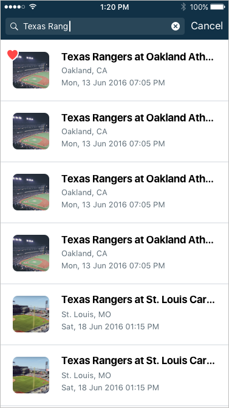
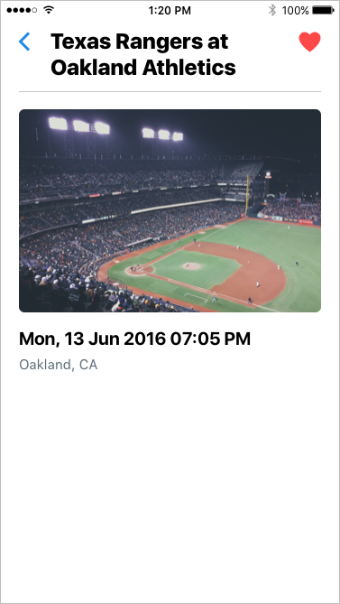

## HomeAway Coding Challenge 

Help us understand how you think about building great software.

#### Summary

Write a type ahead against the Seat Geek API. The type ahead should update a list of results as the search query changes. Results can be tapped to view them on a details screen. On the details screen the result can be favorited. On the type ahead screen, results matching the favorites list should show a visual indication that they are favorited.

To summarize

1. Write a type ahead against the Seat Geek API
2. Make a detail screen so the user can drill down into a result
3. The detail screen should allow the user to favorite the event
4. Type ahead results should contain an indication if they had been favorited previously
5. Favorited results should be saved between launches of the app 

The two screens can look similar to these:

  

#### Guidelines

The coding challenge will be judged on

1. Attention to detail
2. Architectural choices
3. Knowledge of iOS libraries and SDKs 

Please write your code in Swift. Feel free to take advantage of third-party, open source libraries.

An adequate solution might be developed within 4 - 8 hours, but please spend however much time it takes to construct a great solution. 

#### API Information 

The endpoint to use on Seat Geek is free and publicly accessible, but you will need to register for a Seat Geek account and obtain an API key to use it. Details can be found at http://platform.seatgeek.com/

You will pass in the url param of `q` which will correspond to the search query. For example, the below query will give a result set for the term `Texas Ranger`.

```
https://api.seatgeek.com/2/events?client_id=<your client id>&q=Texas+Ranger
```

Full API documentation is available at http://platform.seatgeek.com/#events
